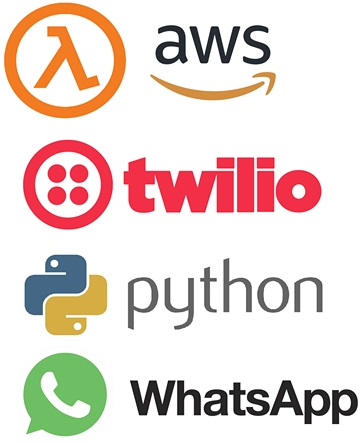

# whatsapp with aws lambda
code for my blog post on whatsapp messaging using AWS lambda.

## Steps:

⋅⋅* Register your number on twilio, whatsapp sandbox page
⋅⋅* If you want to automate your messages, I recomend you to use [AWS](https://aws.amazon.com/es/lambda/features/) Lambda funtions.
..* The important file is whatsapp_messaging.py, there you can modify the target number...
..* Once you modify last file, override the same file into the zip directory, and pack it again.
..* Upload the zip into AWS, and program cron tasks to automate messages.

Feel free to use this code, I've been guided by this [Medium article](https://medium.com/better-programming/i-wrote-a-script-to-whatsapp-my-parents-every-morning-in-just-20-lines-of-python-code-5d203c3b36c1)

